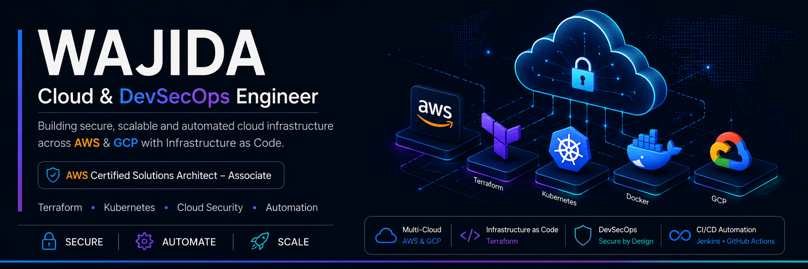

  

 

<h1 align="center">Hi 👋, I'm Wajida</h1>

<h3 align="center">
Cloud & DevSecOps Engineer
</h3>

    

Building secure, scalable cloud infrastructure across AWS & GCP.

## 👩‍💻 About Me

- ☁️ Cloud & DevSecOps Engineer with **4+ years** of experience building and securing cloud infrastructure.
- 🔐 Worked on production AWS environments supporting **150+ cloud instances**, with a focus on automation, security and operational excellence.
- 🏗️ Experienced with **AWS, Terraform, Docker, Kubernetes, Jenkins, GitHub Actions and Cloud Security**.
- 🛡️ Hands-on exposure to **Wiz CSPM, Qualys, IAM, CloudWatch and infrastructure compliance**.
- 🌍 Currently expanding my expertise in **Google Cloud Platform (ACE), Kubernetes and GenAI for Cloud Engineering**.
- 🚀 Open to opportunities in **Cloud Engineering, DevSecOps, Platform Engineering and Site Reliability Engineering (SRE)**.

### ☁️ Cloud

### 🏗️ Infrastructure as Code

### ☸️ Containers & Orchestration

### 🚀 CI/CD

### 💻 Languages & Scripting

### 🔐 Security

### 🖥️ Operating Systems

